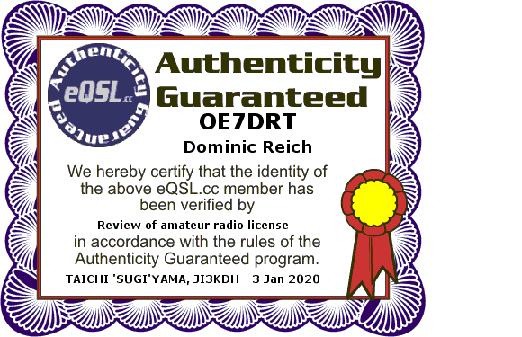

+++
title = "About"
date = "2020-01-02"
aliases = ["about-us","oe7drt"]
#author = "Hugo Authors"
#robotsdisallow = true

+++

Hello, my name is **Dominic** and I maintain this website.  
I am a licensed ham radio operator since 2019 and my callsign is **OE7DRT**.

My QTH is **Längenfeld** - the locator for that is [JN57lb][1].

<!--  -->

## Contact

You can contact me via email, the address is `dominic@` -- append the
domain-name of my website (the one that you are browsing right now) to it.

Feel free to encrypt your message with OpenPGP, use the adress mentioned above
and make sure you got this fingerprint:

```
D49A 3CE2 CCF7 2668 4D98  9A31 BC9D 6AE1 A3BE 169A
```

My public key is on [keys.openpgp.org][2] or on [my website][3] (~4KB).

<!-- Please use the form below, make sure to use a valid email address if you want
an answer back!


	So the contact form is currently not available...
 -->

<!--  -->

## About this website

My website is a personal storage of a set of information about many different
things --- mostly about ham radio and other tech stuff. The main goal of my blog
is for my personal usage. That is because some articles may not explain
everything --- I hope I can reproduce a working setup with all the steps in
these articles.

*I could have saved some links in my bookmarks, right?* Well, I have. But I do that
now for a long time and it sometimes happens, that one or another link becomes
unavailable and hosting my own set of information does not result in these
situations in any way.

You can use the information on these pages for yourself. Just keep in mind, that
some of them may not be very objective or even accurate. The reverse is true. I
fill them with my opinions and experiences; some with solutions --- some not.

### Licenses

The content on my website is licensed under the [CC BY-NC-ND 4.0][4] ---
unless specified otherwise. Content can be text or images or other media that is
used in an article or to display an article. Content is mostly saved within
`/content`, `/static` and `/static/images` but may not be limited to them.
Content files are mostly `png`, `jpg`, `pdf` and `md` files but may not be
limited to them.

Code on my website is **usually** licensed under the [MIT license][5]. This
license also applies to the [codebase of my website][6].

For attribution a link back to my website (`OE7DRT.com`) should be enough.

## Other resources

I used to maintain a broader range of topics on my other website
`dominicreich.com` - but keeping track of all the changes in the more complex
hugo theme made me decide to implement most articles in this smaller one.

For reference, my older website are still accessible on the following URLs:

- [oe7drt.com hugo version][7]  
  this is the website, that you are looking at the moment
- [dominicreich.com jekyll version][8]  
  you can search this website with algolia search
- [dominicreich.com hugo version][9]  
  next version of the older jekyll version but still a few style things won't
  work correctly

[1]: http://www.levinecentral.com/ham/grid_square.php?Grid=JN57lb
[2]: https://keys.openpgp.org/search?q=D49A+3CE2+CCF7+2668+4D98+9A31+BC9D+6AE1+A3BE+169A
[3]: A3BE169A.asc
[4]: https://creativecommons.org/licenses/by-nc-nd/4.0/
[5]: https://github.com/oe7drt/oe7drt-hugo/blob/master/LICENSE
[6]: https://github.com/oe7drt/oe7drt-hugo
[7]: https://oe7drt-hugo-old.netlify.app
[8]: https://dominicreich-old.netlify.com
[9]: https://dominicreich.com