+++
title = 'About'
date = 2020-01-02
lastmod = 2021-01-09T09:36:35+01:00
aliases = ["about-us","oe7drt"]
#author = "Hugo Authors"
#robotsdisallow = true

+++

Hello, my name is **Dominic** and I maintain this website.  
I am a licensed ham radio operator since 2019 and my callsign is **OE7DRT**.

My QTH is **Längenfeld** - the locator for that is [JN57lb][1].

<!--  -->

## Useful links on my website

- [Blog posts on my equipment that I use](/tags/equipment/) -- also [have a look at the projects page](), as I tend to collect the main information
  on my equipment over there
- [Some common "life update" postings](/tags/life/)
- more to come...

## Repeaters around

Those are the repeaters around my home (and my second home). My QTH is around
1180m above sea level (my second home is nearly the same; but 16km to the north).

| Repeater              | Home QTH, Längenfeld       | Second QTH, Ötz            |
| :-------------------- | :------------------------- | :------------------------- |
| OE7XGI Ötztal         | 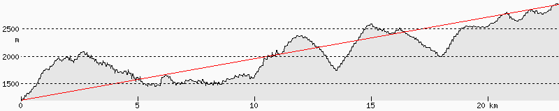 | 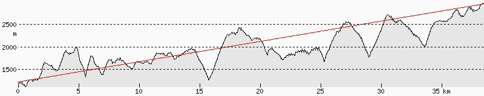 |
| OE7XWH Grünberg       | 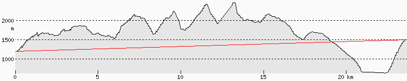 | 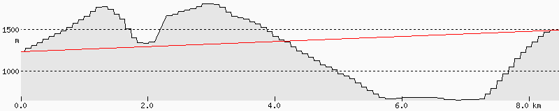 |
| OE7XMR Kaunerberg     | 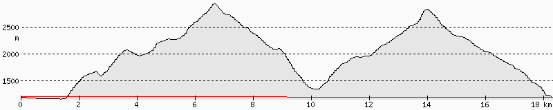 | 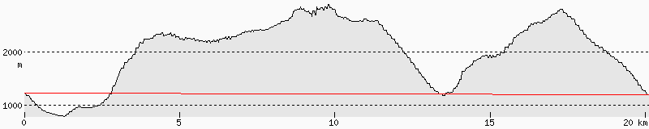 |
| OE7XOI Fiss           | 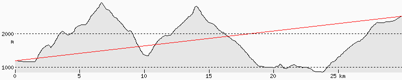 | 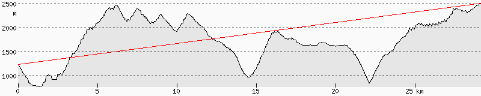 |
| OE7XTR Krahberg       | 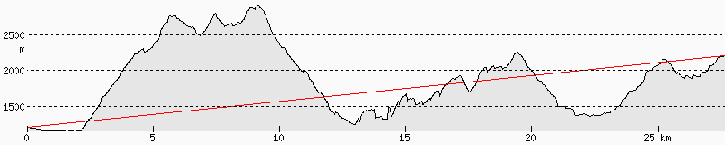 | 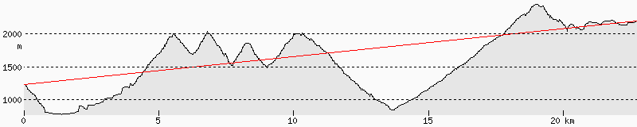 |
| OE7XBI Rangger Köpfl  | 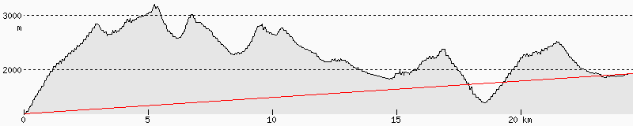 | 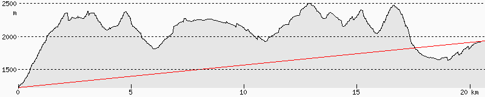 |
| OE7XVR Valluga        | 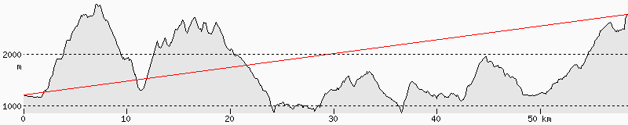 | 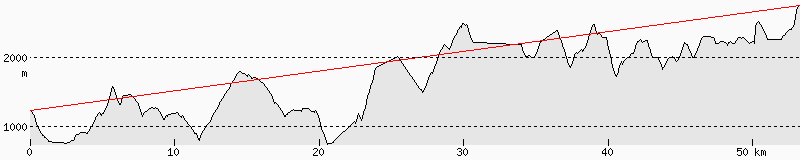 |
| OE7XRT Reutte         | 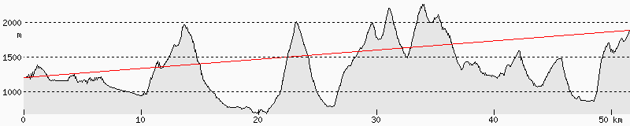 | 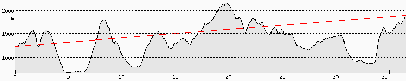 |
| OE7XZR Zugspitze      | 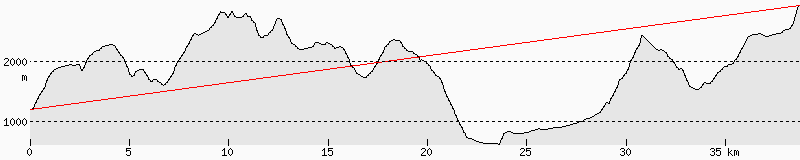 | 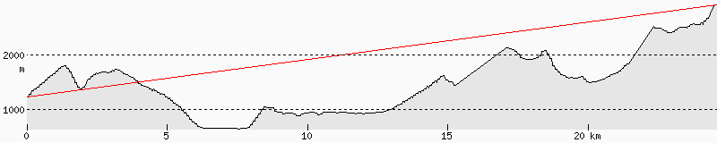 |
| OE7XGR Gefrorene Wand | 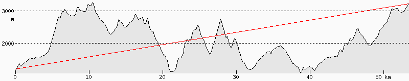 | 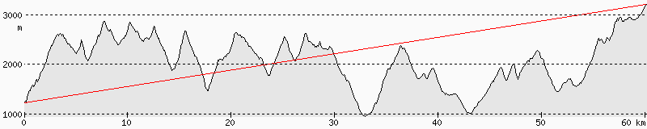 |
| OE7XOT Obtarrenz      | 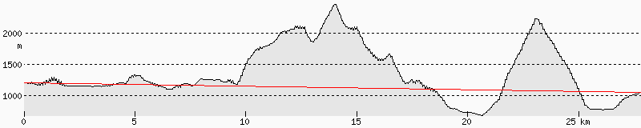 | 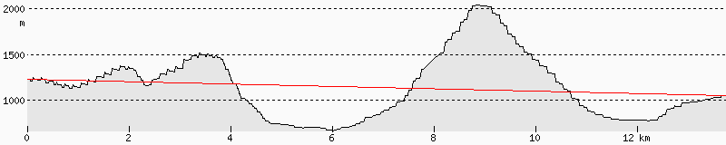 |

For now, I only own some handheld radios so I do not reach those repeaters from
my terrace. I can sometimes open the first two repeater

## Contact

You can contact me via email, the address is `dominic@` -- append the
domain-name of my website (the one that you are browsing right now) to it.

Feel free to encrypt your message with OpenPGP, use the adress mentioned above
and make sure you got this fingerprint:

```
D49A 3CE2 CCF7 2668 4D98  9A31 BC9D 6AE1 A3BE 169A
```

My public key is on [keys.openpgp.org][2] or on [my website][3] (~4KB).

<!-- Please use the form below, make sure to use a valid email address if you want
an answer back!


	So the contact form is currently not available...
 -->

<!--  -->

## About this website

My website is a personal storage of a set of information about many different
things --- mostly about ham radio and other tech stuff. The main goal of my blog
is for my personal usage. That is because some articles may not explain
everything --- I hope I can reproduce a working setup (for me) with all the
steps in these articles.

*I could have saved some links in my bookmarks, right?* Well, I have. But I do that
now for a long time and it sometimes happens, that one or another link becomes
unavailable and hosting my own set of information does not result in these
situations in any way. As long as I need them.

You can use the information on these pages for yourself. Just keep in mind, that
some of them may not be very objective or even accurate. The reverse is true. I
fill them with my opinions and experiences; some with solutions --- some not.

Also, keep in mind that the information on my websites could go offline anytime.

### Licenses

The content on my website is licensed under the [CC BY-NC-ND 4.0][4] ---
unless specified otherwise. Content can be text or images or other media that is
used in an article or to display an article. Content is mostly saved within
`/content`, `/static` and `/static/images` but may not be limited to them.
Content files are mostly `png`, `jpg`, `pdf` and `md` files but may not be
limited to them.

Code on my website is **usually** licensed under the [MIT license][5]. This
license also applies to the [codebase of my website][6].

For attribution a link back to my website (`oe7drt.com`) should be enough.

## Other resources

I used to maintain a broader range of topics on my other website
`dominicreich.com`. I changed the backend software and themes here and there,
mostly trying to find a better solution as the one I currently have ;-)

For reference, my older website are still accessible on the following URLs:

- [dominicreich.com jekyll version][7]

> That is the first site that was published with a static site generator. I used
> [Jekyll][8] at that time. Thanks to [Michael Rose][9] and his efforts on his
> own website I was able to publish a changed version as my own website.

- [dominicreich.com hugo version][10]

> After some time I wanted something slim and less complex to maintain so I gave
> [Hugo][11] a try. The used theme made me switch back to Jekyll again (some
> styling problems that I weren't able to fix quickly enough made me actually
> give Jekyll another try). Besides that I got my radio amateur license at that
> time that also made me buy a new domain --- `oe7drt.com` was online.

- [oe7drt.com hugo version #1][12]

> I was using the slim theme [PaperCSS][13]. I wasn't using this long because
> I was not able to fix the styling on the search page to not disrupt the page
> on mobile devices.

- [oe7drt.com jekyll version with hidejack-theme][14]

> With the search page problems mentioned above I gave [Hydejack][15] a try. I
> tried this already some time [before][16] and bought the Pro version to use with
> [Netlify][17] as a private repository hosted on [Github][18]. I missed the
> slim design of the hugo website and could not resist to give that search
> another try...

- [oe7drt.com hugo version #2][19]

> And here we are. I finally got the search bar styling fixed and it does no
> longer break the layout on smaller screens. I was also able to remove the
> html-tags within the description so the found entries do look a lot better now.

[1]: http://www.levinecentral.com/ham/grid_square.php?Grid=JN57lb
[2]: https://keys.openpgp.org/search?q=D49A+3CE2+CCF7+2668+4D98+9A31+BC9D+6AE1+A3BE+169A
[3]: A3BE169A.asc
[4]: https://creativecommons.org/licenses/by-nc-nd/4.0/
[5]: https://github.com/oe7drt/oe7drt-hugo/blob/master/LICENSE
[6]: https://github.com/oe7drt/oe7drt-hugo
[7]: https://dominicreich-old.netlify.com
[8]: https://jekyllrb.com/
[9]: https://mademistakes.com/
[10]: https://dominicreich.netlify.app/
[11]: https://gohugo.io/
[12]: https://oe7drt-hugo-old.netlify.app
[13]: https://themes.gohugo.io/papercss-hugo-theme/
[14]: https://oe7drt-hidejack.netlify.app
[15]: https://hydejack.com/
[16]: https://dominicreich-hydejack.netlify.app/
[17]: https://www.netlify.com/
[18]: https://github.com/
[19]: /
