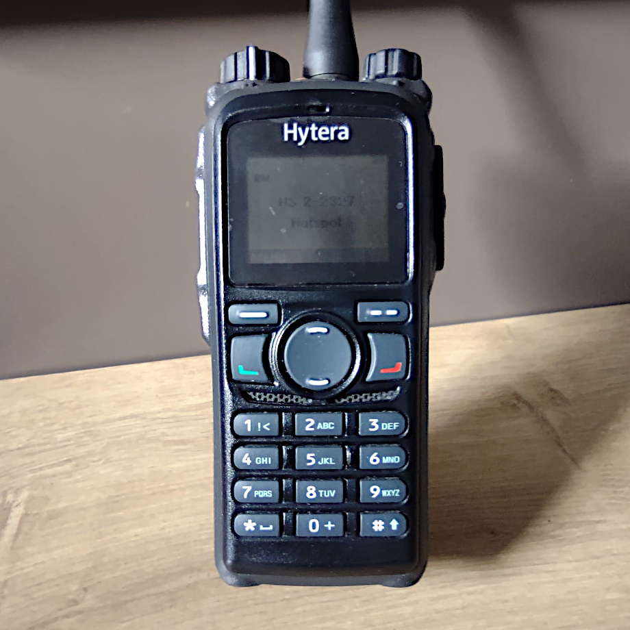

+++
title = "Hytera PD785G"
summary = "The second digital HT that I bought."
date = 2019-12-31

+++

## Specifications

## My two cents

This is the second digital radio that I bought.

The reason for this purchase was my first radio (the [AT D878UV+][1]) actually.
I wasn't able to program it anymore and it din't even announced itself on
the USB port of my computers (neither on Windows, Linux or macOS). So when I
sent back my first radio, I bought this with the hope, that the high priced
radio would not let me down that easy ;-)

I like the radio very much, it is very well made and I like the fact that you
just can type in any talkgroup and hit PTT to start
the transmission.

The modulation is also very good and the feedback suppression is a good addition.

[1]: 
