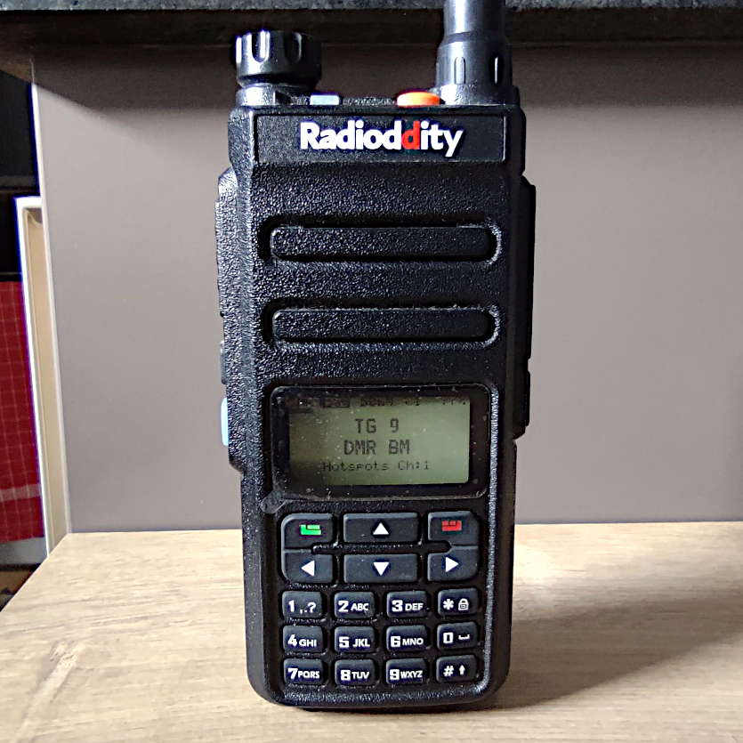
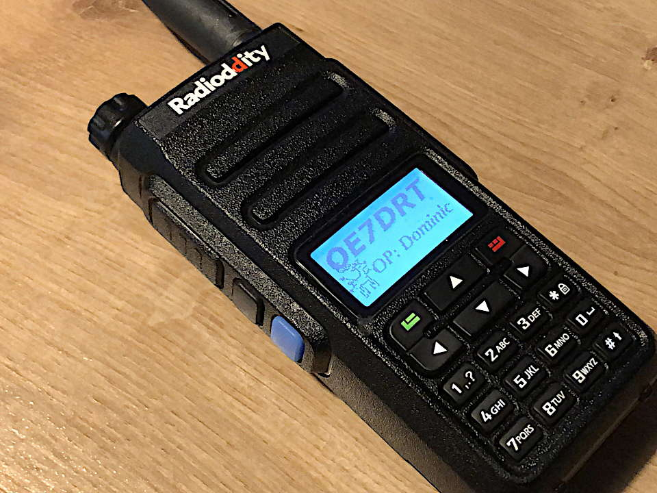
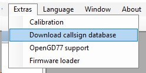
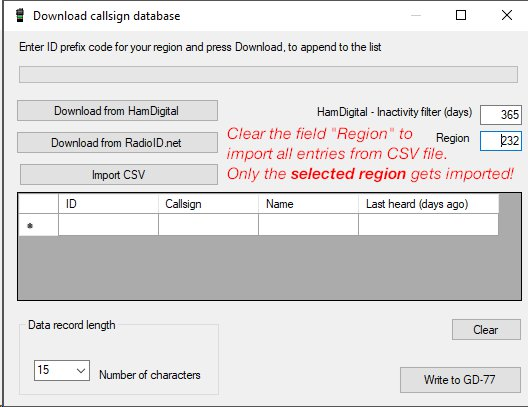

+++
title = "Radioddity GD-77"
summary = "test"
date = 2020-10-22T23:19:14+02:00
#links:
#  - title: OpenGD77 Firmware
#    url: https://github.com/rogerclarkmelbourne/OpenGD77
#   - title: hy-push-state

+++



## Specifications

## My two cents


This page is a work in progress and I will fill this up soon.


This is probably the first DMR capable radio that is made for amateur radio.
Obviosly not per default, but thanks to OpenGD77 it is now suited for amateur
radio usage.



## Original boot tone melody

```
38,6,0,2,38,2,0,2,38,6,0,2,38,2,0,2,38,6
```

## Importing DMR-IDs

Open *Extras --> Download callsign database* and fetch the data that you want.



Set the region to the desired MCC that you want to import. You can also use the
inactivity filter that fetches only recently active DMR-IDs. Or you can import
DMR-IDs from a file.



I usually import them from a CSV-file. The file that I use contains all the
austrian callsigns plus a few other callsigns, that I regularly see. So I need
to import about 2000 callsigns.

If you don't have a proper file to start with use this one here. It contains
these regions: `232, 262, 263, 264, 222, 228`. [Download] (~160KB; 2020-11-16)

[Download]: dmrids_2020-11-16.csv.xz

Or: download your own set of DMR-IDs with the regions you want. You can also
download only some federal states (like `2327,2328`) if you don't want all
entries from `232`. [Read along here][1] for some instructions about this.

[1]: 
